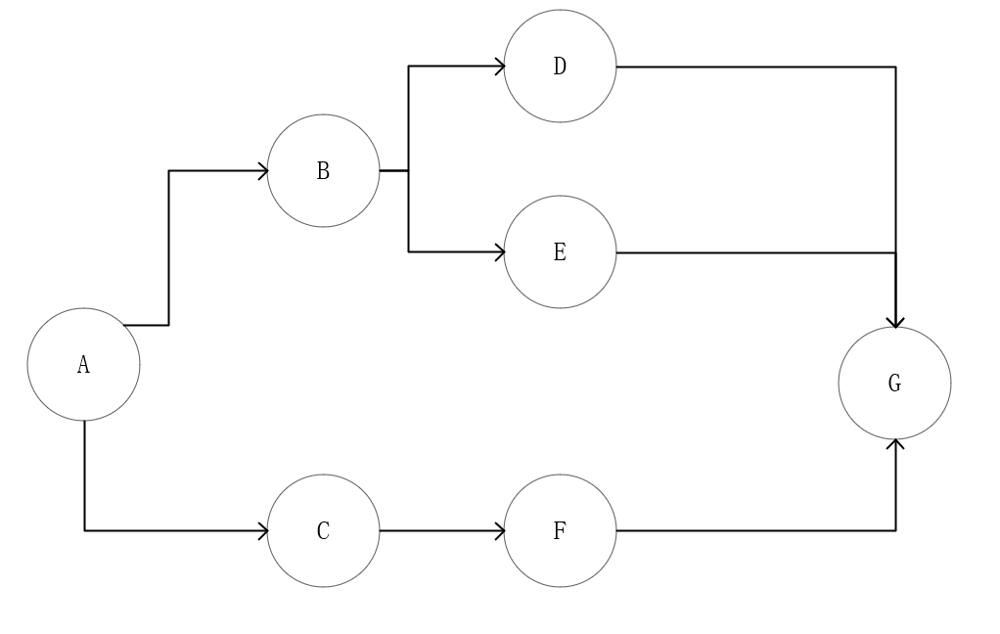

# 流式任务框架

## 背景及应用场景说明

在我们的日常开发中，大部分任务可能都是没有相关性的，例如MQ的处理，这些任务仅使用异步任务框架就能解决，但是还是有一部分任务是有相关性的，例如有三个任务A、B、C，其中C任务依赖B任务执行成功，B任务又依赖A任务执行成功，此时只使用异步任务框架就解决不了我们的问题了，因为异步任务框架调度的时候并不会考虑这些，所以我们基于异步任务框架又提供了一个增强功能，即流式任务框架，使用流式任务框架来解决这种场景；

## 概念

在我们的流式任务框架中，我们定义了两种任务，分别是无限流任务（StreamTask）和有限集任务（SetTask）；对于这两种任务，都是分为一个主任务和多个节点任务，主任务仅仅用于标识整体执行情况，节点任务为实际的待执行任务；

### StreamTask

无限流任务有以下几个特性：

- 无限流任务只有开始，没有结束；
- 一个流（streamId）对应的节点任务数可以是无限大；
- 所有节点任务都是串行执行的；
- 节点任务是按随机顺序执行的；

无限流任务主要用于多个任务需要串行执行的场景；对于无限流任务，节点任务数量是不确定的，在创建的时候我们可以附加一批节点任务到主任务上，而在我们第一次添加完任务后，仍然可以通过流id（streamId）来往这个流上添加任务，理论上可以无限添加节点，而这些节点都会串行执行；

**PS：注意，对于无限流任务，每次添加的任务执行顺序是不确定的，随机的，无限流任务只保证同一个流的所有任务都是串行执行的，但是并不保证他们按照某种顺序执行，即使添加的时候指定了父子关系；**

### SetTask

有限集任务有以下几个特性；

- 有限集任务有明确的开始和结束；
- 有限集任务对应的节点任务数在创建时就是固定的；
- 如果两个节点没有直接或者间接的父子关系，那么这两个节点任务可以并行执行；
- 节点任务是按添加时指定的顺序执行的；
- 有限集任务无论中间分叉多少，最终只能有一个结束节点，所有分叉必须能回到结束节点；

有限集任务则用于一组确定的任务流程编排；对于有限集任务，节点任务数量在创建的时候就是确定的，在创建的时候我们就需要把所有节点任务传进来，系统将会使用用户构建好的顺序来执行任务；与无限流任务的串行执行不同，有限集任务可以根据需要来选择不同任务是串行执行还是并行执行，如下图所示：



对于上述结构的任务，执行描述如下（注意，这个使用的是默认的执行策略AllParentFinish，关于执行策略后续会讲）：

- 先执行A
- B和C没有直接或者间接父子关系，那么这两个节点（包括后边的分支）可以并行执行；
- B节点执行完毕后，D和E没有直接或者间接的父子关系，D和E可以并行执行；
- C节点执行完毕后，F节点开始执行；
- D、E、F节点执行完毕后，G节点开始执行；

## 快速开始

> 注意：流式任务框架依赖于异步任务框架，要使用流式任务框架必须先配置好异步任务框架；

### 引入依赖

如果使用了spring，那么可以使用如下依赖：

```xml

<dependency>
    <groupId>com.github.JoeKerouac</groupId>
    <artifactId>async-task-starter</artifactId>
    <version>2.0.0</version>
</dependency>
```

如果未使用spring，那么应该使用下面的依赖：

```xml

<dependency>
    <groupId>com.github.JoeKerouac</groupId>
    <artifactId>async-task-core</artifactId>
    <version>2.0.0</version>
</dependency>
```

### 初始化数据库，创建async_task表

> 注意，表名也可以自定义，但是需要额外的配置，这里就是用默认表名

```sql
create table if not exists `flow_task`
(
    `request_id`      varchar(200) not null comment '幂等ID',
    `type`            varchar(100) not null comment '流式任务类型，枚举值',
    `first_task_id`   varchar(100) not null comment '流式任务第一个任务的request id',
    `last_task_id`    varchar(100) not null comment '流式任务最后一个任务的request id',
    `status`          varchar(100) not null comment '流式任务状态，枚举值',
    `id`              varchar(100) not null,
    `gmt_create_time` datetime(6)  not null,
    `gmt_update_time` datetime(6)  not null,
    `ext_map`         varchar(2000),
    primary key (`id`)
) ENGINE = InnoDB
  DEFAULT CHARSET = utf8mb4 comment '流式任务主任务表';

create unique index `idx_req` ON `flow_task` (`request_id`);
create unique index `idx_status` ON `flow_task` (`type`, `status`, `gmt_update_time`);


create table if not exists `task_node`
(
    `request_id`       varchar(200)  not null comment '幂等ID',
    `task_request_id`  varchar(200)  not null comment '该节点对应的主任务的幂等ID',
    `node_data`        varchar(2000) not null comment '实际的节点任务数据',
    `processor`        varchar(100)  not null comment '对应的处理器名',
    `status`           varchar(100)  not null comment '节点任务状态，枚举值',
    `fail_strategy`    varchar(100)  not null comment '节点失败策略',
    `execute_strategy` varchar(100)  not null comment '节点执行策略',
    `strategy_context` varchar(1000) not null comment '节点执行策略上下文，允许为null',
    `max_retry`        int           not null comment '最大重试次数',
    `id`               varchar(100)  not null,
    `gmt_create_time`  datetime(6)   not null,
    `gmt_update_time`  datetime(6)   not null,
    `ext_map`          varchar(2000),
    primary key (`id`)
) ENGINE = InnoDB
  DEFAULT CHARSET = utf8mb4 comment '流式任务节点表';

create unique index `idx_req` ON `task_node` (`request_id`);
create index `idx_task_req_status` ON `task_node` (`task_request_id`, `status`, `gmt_update_time`);


create table if not exists `task_node_map`
(
    `task_request_id` varchar(200) not null comment '节点对应的主任务的幂等ID',
    `parent_node`     varchar(200) not null comment '父节点的幂等ID',
    `child_node`      varchar(200) not null comment '子节点的幂等ID',
    `id`              varchar(100) not null,
    `gmt_create_time` datetime(6)  not null,
    `gmt_update_time` datetime(6)  not null,
    `ext_map`         varchar(2000),
    primary key (`id`)
) ENGINE = InnoDB
  DEFAULT CHARSET = utf8mb4 comment '流式任务节点关系表';

create unique index `idx_task_req` on `task_node_map` (`task_request_id`, `parent_node`, `child_node`);
create index `idx_parent_req` on `task_node_map` (`parent_node`);
create index `idx_child_req` on `task_node_map` (`child_node`);

```

### 编程式使用

> 编程式使用比较麻烦，如果可能，请尽量使用spring的方式；

```java


import java.util.Arrays;
import java.util.Collections;
import java.util.Map;
import java.util.UUID;

import javax.sql.DataSource;

import com.github.joekerouac.async.task.flow.AbstractFlowProcessor;
import com.github.joekerouac.async.task.flow.FlowService;
import com.github.joekerouac.async.task.flow.enums.FailStrategy;
import com.github.joekerouac.async.task.flow.impl.LogFlowMonitorService;
import com.github.joekerouac.async.task.flow.impl.StrategyConst;
import com.github.joekerouac.async.task.flow.impl.repository.FlowTaskRepositoryImpl;
import com.github.joekerouac.async.task.flow.impl.repository.TaskNodeMapRepositoryImpl;
import com.github.joekerouac.async.task.flow.impl.repository.TaskNodeRepositoryImpl;
import com.github.joekerouac.async.task.flow.model.FlowServiceConfig;
import com.github.joekerouac.async.task.flow.model.SetTaskModel;
import com.github.joekerouac.async.task.flow.model.StreamTaskModel;
import com.github.joekerouac.async.task.flow.model.TaskNodeModel;
import com.github.joekerouac.async.task.flow.service.FlowServiceImpl;
import com.github.joekerouac.async.task.impl.SimpleConnectionManager;
import com.github.joekerouac.async.task.model.ExecResult;
import com.github.joekerouac.async.task.spi.ConnectionManager;
import com.github.joekerouac.async.task.spi.IDGenerator;
import com.github.joekerouac.async.task.spi.AsyncTransactionManager;
import com.github.joekerouac.async.task.db.AsyncTransactionManagerImpl;

import lombok.AllArgsConstructor;
import lombok.Data;
import lombok.NoArgsConstructor;

/**
 * @author JoeKerouac
 * @date 2022-10-14 14:37:00
 * @since 1.0.0
 */
public class Test {

    public static void main(String[] args) {
        // TODO 请自行提供DataSource
        DataSource dataSource = null;
        ConnectionSelector connectionManager = new SimpleConnectionSelector(dataSource);
        FlowServiceConfig config = new FlowServiceConfig();
        config.setIdGenerator(new IDGenerator() {
            @Override
            public String generateId() {
                // TODO 自己实现逻辑
                return null;
            }
        });

        AsyncTransactionManager transactionManager = new AsyncTransactionManagerImpl(new SimpleConnectionManager(dataSource), null);

        // TODO 根据异步任务框架文档构建好AsyncTaskService后传过来
        config.setAsyncTaskService(null);
        // 这里使用默认的日志监控，对于监控中的错误最好自行实现微信通知等，方便及时人工介入处理；
        config.setFlowMonitorService(new LogFlowMonitorService());
        // TODO 下面这三个repository如果不想使用默认的可以自己实现，或者调用其他构造器
        config.setFlowTaskRepository(new FlowTaskRepositoryImpl(connectionManager));
        config.setTaskNodeRepository(new TaskNodeRepositoryImpl(connectionManager));
        config.setTaskNodeMapRepository(new TaskNodeMapRepositoryImpl(connectionManager));
        config.setTransactionManager(transactionManager);
        // TODO 自行将自己的processor注册过来
        config.getProcessors().add(new TestProcessor());

        // 请自己将该service注册为bean或者全局引用等，方便其他地方使用
        FlowService service = new FlowServiceImpl(config);
        service.start();

        // 添加有限集任务示例
        addSetTask(service);
        // 添加流任务示例
        addStreamTask(service);

        // 请在系统关闭的时候调用该方法
        service.stop();
    }

    /**
     * 添加有限集任务示例；对于示例这个模型，先执行任务1，然后并行执行任务2、3，最后执行任务4
     *
     * @param flowService
     *            流服务
     */
    private static void addSetTask(FlowService flowService) {
        SetTaskModel model = new SetTaskModel();
        model.setRequestId(UUID.randomUUID().toString());
        // TODO 这里processor name我们使用了TestTask，这个是默认生成的，如果我们的processor通过覆写processors方法指定了自定义的name，需要更改为自定义name
        TaskNodeModel nodeModel0 = buildTest("JoeKerouac1", 1, "TestTask");
        TaskNodeModel nodeModel1 = buildTest("JoeKerouac2", 2, "TestTask");
        TaskNodeModel nodeModel2 = buildTest("JoeKerouac2", 3, "TestTask");
        TaskNodeModel nodeModel3 = buildTest("JoeKerouac2", 4, "TestTask");
        nodeModel0.setAllChild(Arrays.asList(nodeModel1, nodeModel2));
        nodeModel1.setAllChild(Collections.singletonList(nodeModel3));
        nodeModel2.setAllChild(Collections.singletonList(nodeModel3));
        model.setFirstTask(nodeModel0);
        model.setLastTask(nodeModel3);
        flowService.addTask(model);
    }

    /**
     * 添加一个流
     *
     * @param flowService
     *            流服务
     */
    private static void addStreamTask(FlowService flowService) {
        // TODO 注意，streamId需要业务方自己保存，一个streamId唯一标识一个流
        String streamId = "testStream";
        StreamTaskModel model = new StreamTaskModel();
        model.setStreamId(streamId);
        TaskNodeModel nodeModel0 = buildTest("JoeKerouac1", 1, "TestTask");
        TaskNodeModel nodeModel1 = buildTest("JoeKerouac2", 2, "TestTask");
        nodeModel0.setAllChild(Collections.singletonList(nodeModel1));
        model.setFirstTask(nodeModel0);
        // 添加流，如果我们指定的streamId对应的无限流任务不存在，那么将会创建，如果存在，那么我们本次添加的任务节点将会附加上去
        flowService.addTask(model);
    }

    /**
     * 构建一个随机的任务节点
     *
     * @param context
     *            name
     * @param id
     *            age
     * @param processor
     *            processor
     * @return 任务节点
     */
    private static TaskNodeModel buildTest(String context, int id, String processor) {
        // TODO 注意，这里根据实际情况来构建我们的任务模型，特别是failStrategy和executeStrategy的选择
        TaskNodeModel model = new TaskNodeModel();
        model.setRequestId(UUID.randomUUID().toString());
        model.setData(new TestTask(context, id));
        model.setFailStrategy(FailStrategy.IGNORE);
        model.setExecuteStrategy(StrategyConst.ALL_PARENT_FINISH);
        model.setProcessor(processor);
        model.setMaxRetry(0);
        return model;
    }

    /**
     * 自定义任务体
     */
    @Data
    @AllArgsConstructor
    @NoArgsConstructor
    public static class TestTask {
        private String context;
        private int id;
    }

    /**
     * 自定义任务处理器
     */
    public static class TestProcessor extends AbstractFlowProcessor<TestTask> {

        @Override
        public ExecResult process(final String requestId, final TestTask context, final Map<String, Object> cache)
                throws Throwable {
            return null;
        }
    }

}

```

### spring的方式使用

#### 1、首先在`application.yaml`中提供如下配置：

> 异步任务框架相关配置请参考异步任务框架文档

```yaml
flow:
  service:
    # 流式任务节点关系构建参数，一次最多对多少个流式任务进行节点关系构建，设置过大可能会导致内存问题，如果不了解原理请勿修改默认值；
    flow-task-batch-size: 10
    # 对于流式任务，一次构建多少个节点关系；
    # PS：一般情况下不建议设置太大，因为在某些场景下可能因为某些任务数特别多的流式任务导致阻塞其他所有任务的正常执行，也不建议设置太小，否则可能影响性能；除非深入了解过处理原理，否则不建议修改默认值；
    stream-node-map-batch-size: 200

```

#### 2、提供以下几个bean

```java

import com.github.joekerouac.async.task.flow.impl.LogFlowMonitorService;
import com.github.joekerouac.async.task.flow.spi.FlowMonitorService;
import org.springframework.context.annotation.Bean;
import org.springframework.context.annotation.Configuration;

/**
 * @author JoeKerouac
 * @date 2022-10-14 14:37:00
 * @since 1.0.0
 */
@Configuration
public class TestConfig {

    @Bean
    public FlowMonitorService flowMonitorService() {
        // 该监控很重要，请自行决定是否要使用默认的，默认监控仅仅打了一个日志
        return new LogFlowMonitorService();
    }

}

```

#### 3、准备我们的任务对象和对应的处理器

##### 任务对象

任务对象中包含本次要处理的任务的核心数据，用户可以自行根据实际任务设计对象；

> 注意，任务对象必须包含一个无参构造器，因为默认序列化的时候使用的是JSON，没有无参构造器会导致反序列化失败，如果无法包含无参构造器，请自行实现序列化/反序列化逻辑；

```java

import lombok.AllArgsConstructor;
import lombok.Data;
import lombok.NoArgsConstructor;

/**
 * @author JoeKerouac
 * @date 2022-10-14 14:37:00
 * @since 1.0.0
 */
@Data
@NoArgsConstructor
@AllArgsConstructor
public class TestTask {

    private String name;

    private int age;

}


```

##### 任务处理器

> 处理器上添加@FlowTaskProcessor注解声明这是一个处理器，同时将会被注册成为spring的bean；
> 注意，这里的泛型TestTask就是我们上边声明的任务TestTask类型；

```java

import com.github.joekerouac.async.task.flow.AbstractFlowProcessor;
import com.github.joekerouac.async.task.starter.flow.annotations.FlowTaskProcessor;
import com.github.joekerouac.async.task.model.ExecResult;

/**
 * @author JoeKerouac
 * @date 2022-10-14 14:37:00
 * @since 1.0.0
 */
@FlowTaskProcessor
public class TestTaskProcessor extends AbstractFlowProcessor<TestTask> {

    @Override
    public ExecResult process(final String requestId, final TestTask context) throws Throwable {
        // 这里放上处理逻辑，处理完后返回处理结果
        return ExecResult.SUCCESS;
    }
}


```

#### 4、在主类上添加@EnableFlowTask注解

> 注意，加了EnableFlowTask注解就不用添加EnableAsyncTask注解了，EnableFlowTask注解自动包含了EnableAsyncTask注解；

```java

import com.github.joekerouac.async.task.starter.flow.annotations.EnableFlowTask;
import org.springframework.boot.SpringApplication;

@EnableFlowTask
public class Main {
    public static void main(String[] args) {
        SpringApplication.run(Main.class);
    }
}
```

#### 5、流式任务系统已经就绪，开始使用

```java


import com.github.joekerouac.async.task.flow.FlowService;
import com.github.joekerouac.async.task.flow.enums.FailStrategy;
import com.github.joekerouac.async.task.flow.impl.StrategyConst;
import com.github.joekerouac.async.task.flow.model.StreamTaskModel;
import com.github.joekerouac.async.task.flow.model.TaskNodeModel;
import org.springframework.beans.factory.annotation.Autowired;
import org.springframework.stereotype.Service;

/**
 * @author JoeKerouac
 * @date 2022-10-14 14:37:00
 * @since 1.0.0
 */
@Service
public class TestService {

    // 直接在我们的服务（bean）中注入流式任务的服务即可
    @Autowired
    private FlowService flowService;

    public void service() {
        // 创建一个任务，这里仅仅是一个简单的示例，可以自行构建更复杂的任务，创建任务这块儿和编程式使用是一致的，可以参考上边编程式使用文档
        // 先创建我们的任务上下文，后续执行任务就是使用该上下文执行的
        TestTask task = new TestTask();

        // 然后定义该任务上下文对应的任务节点
        TaskNodeModel nodeModel = new TaskNodeModel();
        nodeModel.setRequestId(UUID.randomUUID().toString());
        nodeModel.setData(task);
        nodeModel.setFailStrategy(FailStrategy.IGNORE);
        nodeModel.setExecuteStrategy(StrategyConst.ALL_PARENT_FINISH);
        nodeModel.setProcessor(processor);
        nodeModel.setMaxRetry(0);

        // 然后创建主任务，这里创建的是无限流的任务
        // TODO 注意，streamId需要业务方自己保存，一个streamId唯一标识一个流
        String streamId = "testStream";
        StreamTaskModel model = new StreamTaskModel();
        model.setStreamId(streamId);
        model.setFirstTask(nodeModel);

        // 最后将任务加到流式任务处理系统中等待异步处理
        flowService.addTask(model);
    }

}

```

## 高级概念介绍

在上边的文档中有提到失败策略（FailStrategy）和执行策略（ExecuteStrategy），那这两个策略分别是控制什么的呢？下面我们就来讲讲；

### 失败策略(FailStrategy)

失败策略主要是控制任务节点执行失败后（重试达到指定次数仍然失败）任务节点的状态，这个策略比较简单，只有两个，一个是`IGNORE`，一个是`PENDING`，如果用户设置为`IGNORE`，那么节点任务在执行失败后将会变为`ERROR`
状态，否则将会变为`PENDING`状态，这两个状态在执行策略中是有区别的，后续执行策略中会讲；

### 执行策略（ExecuteStrategy）

执行策略是控制节点是否执行的，这个策略稍微复杂些，主要是复杂在有限集任务的处理上，对于有限集任务，因为允许一个任务节点有多个父任务（这里指的是直接父任务，间接父任务不算），所以子节点什么时候执行是一个复杂的事情；

目前系统有四个内置的执行策略，基本可以覆盖大多数场景，如果有需要，也可以自行实现，下面我们先讲下系统内置的四个执行策略；

#### 1、SpecialParent

子节点在指定的requestId的父级全部执行成功时才能执行，如果有一个指定的父节点`ERROR`或者`PENDING`，那么子节点将会`PENDING`；

注意，使用该策略的时候要给任务节点设置`strategyContext`，值为父节点的requestId列表，多个requestId以英文逗号分割；

#### 2、MinAmountParent

当子节点对应的父节点执行成功数量达到我们的要求子节点就可以执行了，无需等待所有父节点执行完毕；如果已经确定满足不了这个条件，例如总共10个父任务，要求最少执行成功5个，结果其中6个已经失败了，那么此时已经明确确定满足不了我们的条件了，此时子节点将会pending；

注意，使用该策略的时候要给任务节点设置`strategyContext`，值为数字字符串，表示父节点最少要有多少个执行成功才能满足条件；

#### 3、AllParentSuccess

必须所有父节点执行成功才可执行，如果任意一个父节点执行error或者pending，那么节点会pending；

`strategyContext`要求为空；

#### 1、AllParentFinish

必须所有父节点执行完成才可执行，如果任意一个父节点pending，那么节点会pending，注意，这个不要求父节点必须是SUCCESS，父节点是ERROR也是可以校验通过的；

`strategyContext`要求为空；

